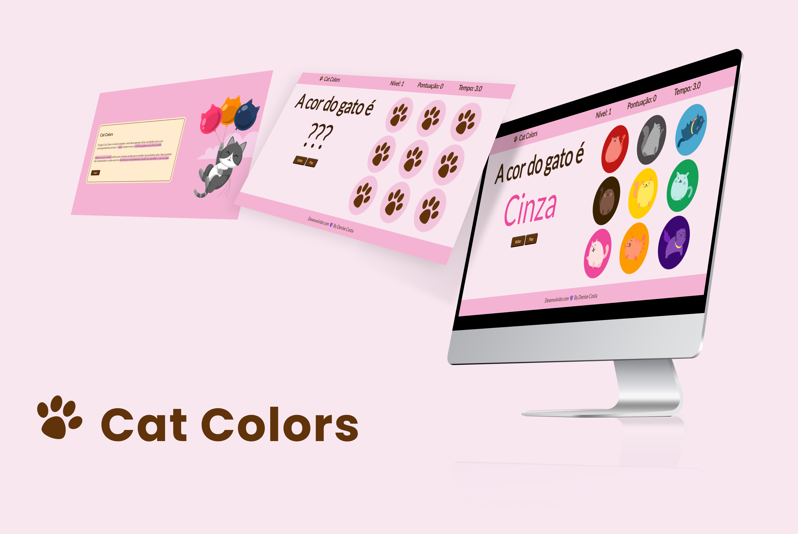

# Cat Colors Game
Cat Colors é um jogo em JavaScript que apresenta nove botões com imagens representando diferentes cores. Além disso, uma palavra é exibida em uma cor correspondente a um desses botões. O objetivo do jogador é clicar no botão que representa a cor correta antes que o tempo acabe. É um jogo divertido e envolvente que testa suas habilidades de reconhecimento de cores e tempo de reação.

Durante o desenvolvimento do projeto, foram aplicados conceitos de HTML para estruturar a página do jogo, CSS para estilização e aparência visual, e JavaScript para a lógica do jogo e interação com o usuário.

## Recursos

- Jogabilidade simples e intuitiva.
- Nove botões com imagens relacionados a cada uma das cores que são embaralhados, dependendo do nível de dificuldade.
- Combinações de palavras e cores geradas aleatoriamente a cada rodada.
- Nível de dificuldade crescente à medida que o jogo avança.
- Níveis e pontuação são controlados e exibidos na interface para monitorar seu progresso.
- Cronômetro para adicionar emoção e desafio.
- O jogo é reiniciado quando a jogada está incorreta, o tempo acaba ou atingue o nível 7.
- Um modal de resultado é exibido ao final do jogo, com mensagens personalizadas de acordo com o evento que o disparou.

## Como Jogar

1. Clique no botão **Jogar** para iniciar o jogo.
2. Observe a palavra exibida e identifique a cor da palavra.
3. Clique no botão que corresponde à cor da palavra antes que o cronômetro acabe.
4. Se você selecionar a cor correta, ganhará um ponto e passará para a próxima rodada.
5. Se você selecionar a cor errada ou o tempo acabar, o jogo termina.
6. Tente obter uma pontuação alta selecionando as cores corretas o mais rápido possível.

## Tecnologias Utilizadas

- HTML
- CSS
- JavaScript

## Instalação

1. Clone o repositório: `git clone https://github.com/DeniCosta/ColorsCatGame.git` 
2. Abra o projeto no seu editor de código preferido.
3. Inicie o jogo abrindo o arquivo `index.html` em seu navegador da web.

## Divirta-se!!
